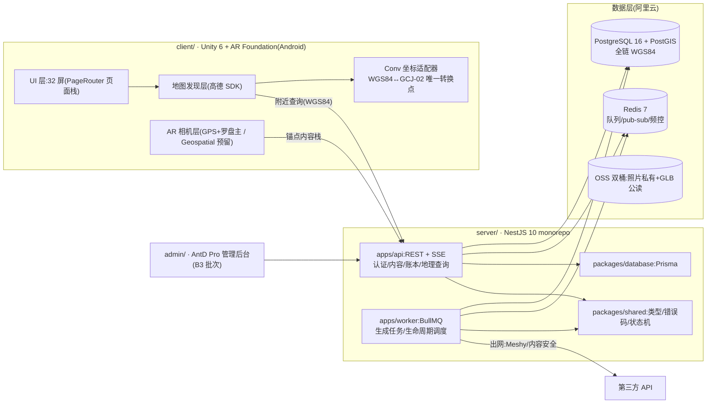

# VR 留念(vr-memento)

> 基于地理位置的 AR 3D 内容放置、发现与社交留念 App(Android)+ 服务端 + 管理后台。
> 地图先行发现附近内容 → 前往 AR 浏览 → 放置/照片生成 3D → 打卡合影分享微信 → 足迹沉淀;Token 驱动生成与社区流通。

| 项 | 值 |
|---|---|
| 仓库 | `git@github.com:JasperLins/VR_Camera.git` |
| 开发基准 | `work/docs/08-handoff/ai-dev-handoff.md`(27 任务包 / 6 批次 / 32 屏) |
| 编码规范 | [CONVENTIONS.md](./CONVENTIONS.md)(**写代码前必读**) |
| 进度台账 | `work/dev-log.md` |
| 排期 | Sprint-0 → B1~B5;P0 闭环 2026-12-15,全量提审 2027-01-05 |

---

## 1. 总架构



要点(摘自 work/docs/04-tech/tech-stack.md):
- **全链 WGS84**,唯一 GCJ-02 转换点在客户端 `Conv`(D-006);
- Token 权威余额只在服务端账本(A-405),账本只插入不更新 + 幂等键;
- 生成任务 DB 状态机为事实源,SSE 优先/轮询兜底,失败全退/取消比例退。

## 2. 仓库地图

| 目录 | 职责 | 详细说明 |
|---|---|---|
| `work/` | 需求/技术/UI 文档 + 32 屏高保真原型(**只读规格区**) | [work/README 视角](./work/AGENTS.md) |
| `client/` | Unity 6 + AR Foundation Android 客户端(前端) | [client/README.md](./client/README.md) |
| `server/` | NestJS monorepo:API + Worker + 共享包(后端) | [server/README.md](./server/README.md) |
| `admin/` | AntD Pro 管理后台(B3/PKG-22 批次开发,现为占位) | [admin/README.md](./admin/README.md) |

## 3. 功能需求 → 代码目录对照(FR-01~14)

| FR | 功能(优先级) | 客户端目录 | 服务端模块(规划) | 批次 |
|---|---|---|---|---|
| FR-01 | 地图发现(P0) | `client/.../Map` | `modules/geo` | B2/B3 |
| FR-02 | AR 浏览(P0) | `client/.../AR` | —(纯客户端锚定) | B2 |
| FR-03 | 内容放置(P0) | `client/.../Placement`(B3 建) | `modules/content` | B3 |
| FR-04 | 照片生成 3D(P0) | `client/.../Generation`(B3 建) | `modules/generation` + worker | B2/B3 |
| FR-05 | 打卡合影(P0) | `client/.../Checkin`(B3 建) | `modules/checkin` | B3 |
| FR-06 | 生命周期(P0) | `client/.../ContentManage`(B3 建) | `modules/lifecycle` + worker | B3 |
| FR-07 | Token 账户(P0) | `client/.../UI`(钱包页) | `modules/ledger` | B1 |
| FR-08 | 积分体系(P1) | — | `modules/points` | B2/B4 |
| FR-09 | 模型商店(P1) | `client/.../Store`(B4 建) | `modules/store` | B4 |
| FR-10 | 单向评论(P2) | —(浮层复用) | `modules/comment` | B5 |
| FR-11 | 虚拟同框(P1) | `client/.../AR`(B4 扩展) | — | B4 |
| FR-12 | 审核版权防线(P0) | — | `modules/moderation` | B2/B3 |
| FR-13 | 打卡足迹(P1) | `client/.../Footprints`(B4 建) | `modules/footprint` | B4 |
| FR-14 | seeding 运营(P1) | — | `modules/seeding` | B4 |

> 目录名带「(Bx 建)」= 该批次开工时创建,当前尚不存在;服务端模块均为规划位。

## 4. 环境矩阵与快速启动

| 依赖 | 要求 | 本机状态(2026-08-22) |
|---|---|---|
| Node.js | 20 LTS(文档口径);实测 24.x 兼容 | ✅ v24.19.0(偏差已登记 dev-log) |
| pnpm | ≥8,registry 建议 npmmirror | ✅ 已装 |
| Docker Desktop | 用于本地 PostgreSQL 16+PostGIS / Redis 7 | ✅ 已装(用前启动守护进程) |
| Unity | **Unity 6 LTS(6000.0.x)+ Android Build Support 全套** | ⏳ 待安装(见 client/README.md) |
| Git | ≥2.30 | ✅ 已装 |

**启动服务端(3 步)**:

```bash
cd server
docker compose up -d          # 1. 起本地中间件(PG+PostGIS / Redis)
pnpm install                  # 2. 装依赖
pnpm dev                      # 3. 起 API(localhost:3000/health 与 /docs)
```

**打开客户端**:安装 Unity 6 LTS 后,Unity Hub → Open → 选择 `client/` 目录,详见 [client/README.md](./client/README.md)。

## 5. 批次进度索引

| 批次 | 任务包 | 状态 | 备注 |
|---|---|---|---|
| Sprint-0 | PKG-01~07 工程地基 + 三预研 | 🔄 进行中 | AI 侧地基本次交付;PR-1/2/3 真机预研待人工 |
| B1 | PKG-08/09/13 基础面 | ⬜ 未开始 | — |
| B2 | PKG-10/12/14/17/18 核心引擎 | ⬜ 未开始 | — |
| B3 | PKG-11/15/16/19/20/21/22 体验闭环 | ⬜ 未开始 | M1=2026-12-15 |
| B4 | PKG-23~26 P1 增强 | ⬜ 未开始 | — |
| B5 | PKG-27 + SIT/上架 | ⬜ 未开始 | M3=2027-01-05 |

最新状态以 `work/dev-log.md` 为准。
