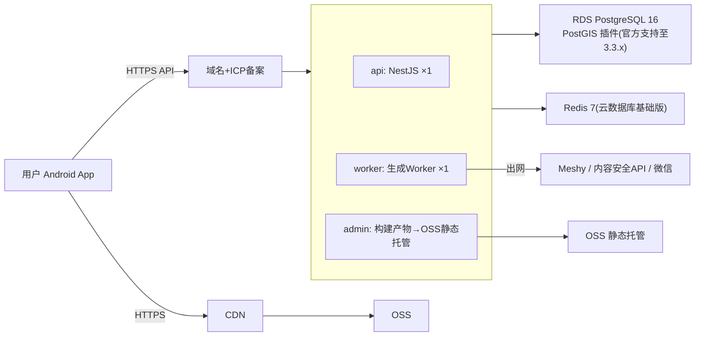
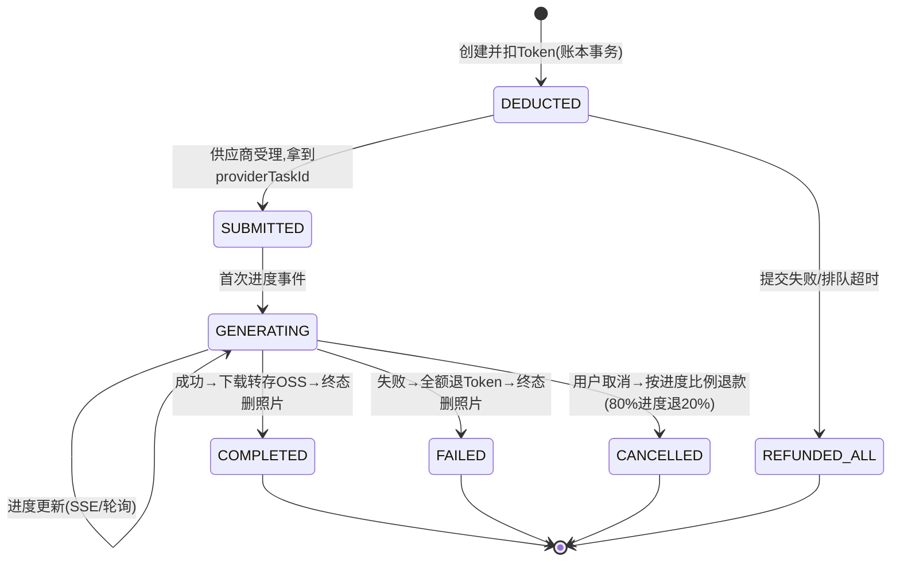

# 「VR 留念」技术栈选型报告

| 版本 | 日期 | 状态 | 作者 |
|---|---|---|---|
| v0.2 | 2026-08-22 | 已确认(2026-08-22 批量确认 D-022~D-029) | 架构师 |

## 📌 文档头契约(下游先读这节)

**关键结论(≤5 条)**
1. 推荐服务端方案:**NestJS(TypeScript)+ PostgreSQL 16/PostGIS + Redis + 阿里云部署**,三方案加权打分 4.50 / 4.15 / 3.93(满分 5)。
2. 坐标系(D-006):**服务端与 AR 锚定全链 WGS84,唯一的 WGS84→GCJ-02 转换点归属客户端「地图显示层适配器」**;地图 SDK 推荐**高德**(官方 Unity 优化 SDK + 仅一次坐标系转换),百度 BD-09 会引入第三套坐标系被否。
3. 3D 生成网关:`Gen3DProvider` 抽象接口 + Meshy 单适配器(D-014),DB 任务表为事实源,Worker 消费队列,**对客户端 SSE 优先、轮询兜底**。
4. **P0 风险:ARCore Geospatial 在中国大陆基本不可用**(VPS 无覆盖、Google 服务不可达,置信度高)——Sprint-0 真机验证 + 预置「GPS+罗盘降级锚定」路径,服务端数据模型两种模式通用。
5. 基础设施:阿里云 ECS(docker-compose)+ RDS PostgreSQL(PostGIS 官方支持)+ OSS 双桶(照片桶私有+生命周期删除/GLB 桶公读+CDN);管理后台 Ant Design Pro。

**关键假设与置信度**(全部工作假设见文末,供 decisions.md 假设账本登记)
- 后端部署中国大陆云(ICP 备案 + 境内第三方依赖):高;
- ARCore Geospatial 大陆不可用:高(官方 VPS 覆盖机制 + Google 服务屏蔽,来源:Google AR 官方文档,2026-08 检索);
- 高德 Unity SDK(游戏行业旗舰版)满足渲染+标记:中高,需 Sprint-0 POC;
- Meshy API 从大陆服务器可稳定调用:低,未验证。

**可引用承诺**:技术栈清单、架构图、风险表、3D 网关状态机、数据库 schema 草案(§8)可直接被阶段 5(UI/UX)、阶段 6(AI 开发计划)、阶段 7(报价)引用;工时回填校准以本报告选型为准;本报告只标注第三方依赖,费用测算归 `third-party-services.md`。

**未决问题**:①ARCore Geospatial 降级策略(见 §10 Q1);②云厂商默认阿里云(Q2);③阶段 2/3 标准产物 `feasibility.md`/`feature-list.md` 缺失,属已知欠账,由阶段 4 回填循环补建(项目经理编排);④Meshy 询价与境内可达性实测(Q4,归 third-party-service-scout + Sprint-0)。

---

## 1. 选型约束

| 约束 | 内容 | 来源 |
|---|---|---|
| 客户端(锁定) | Unity + AR Foundation 原生 App;Android 先行(ARCore Geospatial),iOS 二期 | D-002 / D-005,不做对比 |
| 业务范围 | 十大模块(地图发现/AR 浏览/放置/照片生成 3D/打卡合影/生命周期/Token/商店社区/版权防线/虚拟同框);无付费交易(D-011),Token 不可提现不可逆 | PRD v0.2 |
| 坐标系 | 存储/锚定全链 WGS84,仅地图显示层转 GCJ-02;验收:同锚点「地图显示位置 vs AR 锚定位置」偏差 ≤10m | D-006 |
| 海拔 | 户外 ±5m 容差的服务端范围过滤;AR 会话内相对高度辅助 | D-012 |
| 服务端需求 | 地理空间索引(中心+半径+海拔)、3D 生成网关(异步/SSE)、Token/积分账本(事务)、内容审核、模型商店、对象存储、管理后台 | PRD 架构图 |
| 合规 | ICP 备案、AI/深度合成标识与算法备案、人脸照片(敏感个人信息)单独同意+即传即删、地图审图号展示 | PRD 第 7 章 |
| 团队 | 初创小团队;开发以 AI 辅助为主(阶段 6 出计划);成本敏感,优先免费额度 | 项目画像 |
| 上线形态 | 自研创业产品,需真实上线运营(非 demo) | D-001 |

> 说明:阶段 2/3 标准产物缺失,本报告选型依据 = 项目经理注入的 PRD 头契约摘要 + PRD v0.2 原文(按需 grep 定位)+ 项目画像。

## 2. 候选方案

客户端与 AR 层已定(D-002),三套方案仅对比「服务端 + 数据 + 管理后台 + 部署」。

| 方案 | 客户端 | 管理后台 | 后端 | 数据库 | 异步任务 | 部署 | AI 能力接入 |
|---|---|---|---|---|---|---|---|
| **A. TypeScript 单语言栈(推荐)** | Unity(已定) | React 18 + Ant Design Pro(TS) | NestJS 10 + Prisma ORM | PostgreSQL 16 + PostGIS + Redis 7 | BullMQ(Redis)+ DB 任务表 | 阿里云 ECS docker-compose + RDS + OSS/CDN | 服务端网关调 Meshy 文生 3D API;内容安全 API;均不自部署 |
| **B. Python 栈** | Unity(已定) | React + Refine | FastAPI + SQLAlchemy 2 | 同上(PostGIS) | Celery + Redis | 同上 | 同上 |
| **C. Java 栈** | Unity(已定) | Vue3 + Element Plus | Spring Boot 3 + MyBatis-Plus | 同上(PostGIS) | RabbitMQ | 同上 | 同上 |

AI/3D 生成调用方式说明(SKILL 要求):**全部走第三方 API(服务端出网调用),不自部署开源 3D 生成模型**。理由:开源方案(如 TripoSR 级别)在照片→高质量带贴图人像/物体生成上质量与生态显著落后商用 API,且 GPU 推理月成本(单卡 4090 级 ≥ 千元/月)远超初创「优先免费额度」约束(判断,置信度:中;用量单价对比归 third-party-services.md)。照片审核走内容安全 API(机审),3D 模型抽检走管理后台人审流程(PRD 5.9/第 7 章)。

## 3. 打分对比(0–5 分)

维度与权重沿用 skill 默认(开发效率 20% / 生态成熟度 20% / 招聘·AI 语料 15% / 运行成本 15% / 可扩展性 15% / AI 开发契合度 15%);权重不覆盖,理由:初创 + AI 辅助开发模式下六个维度对本项目同等关键,默认权重已偏重效率与语料。**评分为架构师主观判断(置信度:中),依据列于注释。**

| 维度(权重) | A. NestJS/TS | B. FastAPI | C. Spring Boot |
|---|---|---|---|
| 开发效率(20%) | 4.5 | 4.0 | 3.0 |
| 生态成熟度(20%) | 4.5 | 4.0 | 5.0 |
| 招聘/AI 语料充分度(15%) | 5.0 | 4.5 | 4.5 |
| 运行成本(15%) | 4.0 | 4.0 | 2.5 |
| 可扩展性(15%) | 4.0 | 4.0 | 5.0 |
| 与 AI 开发契合度(15%) | 5.0 | 4.5 | 3.5 |
| **加权总分** | **4.50** | **4.15** | **3.93** |

计算过程:A = 4.5×0.2 + 4.5×0.2 + 5.0×0.15 + 4.0×0.15 + 4.0×0.15 + 5.0×0.15 = 0.90+0.90+0.75+0.60+0.60+0.75 = **4.50**;B = 0.80+0.80+0.675+0.60+0.60+0.675 = **4.15**;C = 0.60+1.00+0.675+0.375+0.75+0.525 = **3.93**。

评分依据摘要:
- **AI 开发契合度**:A 得 5——TS 单语言贯穿「API + Worker + 管理后台 + 共享类型定义」,AI 代理可在 monorepo 内跨端复用上下文,NestJS 强约定(DI/Module/DTO)显著降低 AI 生成代码的结构漂移;C 得 3.5——样板代码多、启动重,AI 生成可运行样板的迭代周期长。
- **运行成本**:C 得 2.5——JVM 常驻内存 ≥1GB,小规格 ECS 跑不动,免费/低价额度覆盖差;A/B Node/Python 进程 300–500MB 量级可跑在入门规格(经验值,置信度中)。
- **生态**:C 得 5(企业级组件最全)但在本项目无支付网关对接、无复杂分布式等 Java 强项场景(模型商店无付费交易,D-011),优势兑现不了。

## 4. 推荐结论

**推荐方案 A:NestJS(TypeScript)+ PostgreSQL 16/PostGIS + Redis/BullMQ + 阿里云 + Ant Design Pro 管理后台。**

**理由**:①单语言栈最大化 AI 辅助开发杠杆(团队现状:AI 开发为主);②PostGIS 是唯一原生满足「中心点+半径+海拔」三维范围查询并同库承载 Token 事务账本的方案;③NestJS 内置 SSE 支持,匹配 PRD 的生成进度推送;④docker-compose 单机起步、后续平滑横向扩容,匹配「免费额度优先」。

**为什么不选其他**:
- **不选 B(FastAPI)**:能力足够,但 Python 仅覆盖 API/Worker,管理后台仍需 TS,双语言增加 AI 代理上下文切换与类型重复维护;Python 异步生态(依赖锁、版本管理)在 AI 代理自动维护下更易出错。差距主要在工程一致性而非能力。
- **不选 C(Spring Boot)**:加权输在运行成本与 AI 开发契合度;其生态优势(支付、大型分布式)在 D-011 无付费交易、单区域冷启动的本期无法兑现。若二期引入大额支付与多供应商路由,可在 3D 网关前加独立 Java 服务,不影响本期选型。

## 5. 系统架构图

### 5.1 模块划分与数据流(覆盖全部 P0 模块)

```mermaid
flowchart TB
    subgraph Client["客户端 Unity + AR Foundation(已定 D-002)"]
        MAP["地图层/雷达引导<br/>模块① 高德Unity SDK 显示"]
        CONV["坐标转换适配器(唯一转换点)<br/>WGS84→GCJ-02 仅服务地图显示"]
        AR["AR 相机层<br/>模块② ARCore Geospatial(WGS84)<br/>LOD/设备分级渲染"]
        PLACE["内容放置准星对位<br/>模块③ 官方库/我的模型/照片生成"]
        GEN["生成流程页<br/>模块④ 上传→配置→进度→预览"]
        PHOTO["打卡合影<br/>模块⑤ 截屏合成+存相册+微信分享"]
        MINE["管理页<br/>模块⑥ 内容列表/生命周期"]
        SAME["虚拟人物同框<br/>模块⑩ 官方形象+用户形象(上限2)"]
    end

    subgraph Server["服务端 NestJS(TS)· 全链 WGS84"]
        API["API 服务<br/>认证/内容CRUD/商店/社区"]
        GEO["地理查询服务<br/>模块① 中心+半径+海拔±5m(D-012)<br/>低缩放级返回网格聚合计数"]
        TOKEN["Token/积分账本服务<br/>模块⑦ 事务+幂等+防刷规则"]
        GW["3D 生成网关<br/>模块④ Gen3DProvider 抽象接口"]
        WORKER["生成 Worker<br/>模块④ 状态机+SSE转发"]
        SSE["SSE 推送端点<br/>/v1/tasks/:id/events"]
        LIFE["生命周期调度<br/>模块⑥ 失效自动隐藏 定时扫描"]
        MOD["审核服务<br/>模块⑨ 图文机审+模型抽检队列+AI生成标识"]
    end

    subgraph Data["数据层"]
        PG[("PostgreSQL 16 + PostGIS<br/>内容/锚点/账本/任务表<br/>坐标一律 WGS84")]
        REDIS[("Redis 7<br/>BullMQ队列/缓存/SSE pub-sub/频控")]
        OSSP[("OSS 照片桶·私有<br/>人脸照片 24h 生命周期+终态即删")]
        OSSF[("OSS GLB桶·公读 + CDN<br/>模型/缩略图分发")]
    end

    subgraph Third["第三方(依赖清单,费用见 third-party-services.md)"]
        AMAP["高德开放平台<br/>Unity SDK/定位/坐标转换"]
        MESHY["Meshy 文生3D API<br/>默认候选 D-014"]
        WX["微信开放平台+微信支付<br/>分享/登录/Token套餐"]
        SAFE["内容安全 API(图文机审)"]
        GG["ARCore/Geospatial<br/>Google(大陆受限→R1)"]
    end

    MAP --- CONV
    MAP -->|"附近查询(客户端转回WGS84上送)"| API
    AR -->|"锚点内容栈查询"| GEO
    AR -->|"设备姿态 WGS84"| AR
    PLACE -->|"放置/可见性/失效时间"| API
    GEN -->|"创建任务(扣Token)"| TOKEN
    GEN -->|"SSE进度/轮询兜底"| SSE
    PHOTO -->|"积分奖励/防刷校验"| TOKEN
    PHOTO -.->|"分享SDK直连"| WX
    MINE -->|"隐藏/删除/重开"| API
    SAME -->|"同框合成(客户端)"| PHOTO
    TOKEN --> PG
    GW --> WORKER
    WORKER -->|"出网调用"| MESHY
    WORKER -->|"下载原图→转存"| OSSF
    WORKER -->|"终态删照片+退款"| OSSP
    WORKER -->|"进度发布"| REDIS
    REDIS --> SSE
    API --> GEO
    API --> MOD
    MOD -->|"机审"| SAFE
    LIFE --> PG
    GEO --> PG
    MAP -.->|"SDK内嵌"| AMAP
    AR -.->|"锚定API"| GG
```



要点:
- **WGS84/GCJ-02 转换只发生在客户端 `CONV` 一个节点**(归属论证见 §7.3);服务端任何 API 的出入参坐标一律 WGS84。
- 模块⑧(模型商店/社区)复用 API + TOKEN + OSSF,不单独成服务(纯积分分享,D-011);模块⑨ 版权四层防线中,服务端承担机审接入、感知哈希(phash)比对入库、抽检队列、举报下架通道。
- 低缩放级「网格聚合计数」由服务端返回(geohash 网格聚合),同时解决:①不依赖高德 SDK 是否内置 Unity 聚合(置信度低,见 R6);②降低附近查询响应体。

### 5.2 部署拓扑(阿里云单区域,免费额度优先)



MVP 单区域(杭州/深圳)单实例;API 与 Worker 同机不同容器,DB/Redis 用云托管版;扩容路径:API 容器横向复制 + SLB,SSE 经 Redis pub/sub 天然支持多实例。监控:Sentry 免费档 + 云监控。

## 6. 技术风险清单

| # | 风险 | 影响 | 缓解方案 | 备选方案 |
|---|---|---|---|---|
| R1(P0) | **ARCore Geospatial 大陆基本不可用**(VPS 基于 Google 街景无大陆数据;arcore.googleapis.com 不可达;置信度高,来源:Google AR 官方文档) | AR 锚定精度从米级降至 GPS 级(5–10m+),核心体验受损,直接威胁产品差异化 | ①Sprint-0 真机实测(与 D-006 的 ≤10m 验收合并执行);②客户端内置 `CheckVpsAvailability`,不可用时自动降级「GPS+罗盘锚定」;③服务端锚点数据模型按「锚定模式无关」设计(存 WGS84 坐标+海拔,不存 Geospatial 专有句柄),两种模式共用 | 国产 AR 引擎/自研 VPS(触及 D-002 客户端决策边界,须用户裁决,见 Q1);首发城市限定 + 提高 seeding 密度弥补精度 |
| R2 | WGS84→GCJ-02 转换误差叠加(PRD 指出混用坐标会产生 50–500m 级偏移;正确单点转换后残余误差约 1–2m,公开算法共识,置信度中) | 地图标记与 AR 实物错位,用户「按图索骥」失败 | 单一转换点(§7.3)+ 转换函数单元测试 + D-006 真机验收流程(≥30 锚点×≥3 机型,偏差 ≤10m) | 高德官方坐标转换 API(批量受限)兜底校准 |
| R3 | Meshy 供应商锁定:跨境可达性未验证(置信度低)、价格/商用版权条款可变 | 生成功能整体不可用或成本失控 | `Gen3DProvider` 抽象缝(§7.1)+ 配置化切换;Sprint-0 从 ECS 实测 Meshy API 连通与延迟;关注付费档「完整商业所有权」条款(PRD 5.4) | Tripo(国内厂商 VAST,境内可达性预期更好——置信度中)/ Rodin;二期多供应商路由(D-014) |
| R4 | 生成式 AI 合规:算法备案/深度合成标识时间线不可控;人脸照片属敏感个人信息 | 应用上架/应用市场审核受阻;个人信息保护法风险 | ①模型元数据与商店页强制「AI 生成」标识;②人脸照片单独同意 + 上传走私有桶 + 终态即删 + 24h 生命周期双保险;③备案与 ICP 并行提前启动 | 灰度期先上「官方库+上传」两条放置路径(不涉生成),生成功能后置开闸 |
| R5 | Token/积分防刷(多账号薅积分、生成退款套利) | 经济系统通胀、3D 生成成本被刷爆 | 账本事务+幂等键+每日上限+设备指纹+新号冷却(PRD 5.7 防刷规则服务端统一落地);退款规则代码化(取消按进度比例退) | 第三方风控服务(成本增加,二期) |
| R6 | 高德 Unity SDK(游戏行业旗舰版)标记聚合/交互能力边界未验证(置信度低-中) | 地图层交互降级 | Sprint-0 POC 验证渲染+标记+聚合一组能力;服务端已按网格聚合返回,SDK 聚合仅为增强 | 原生 Android 地图 View 与 Unity 混合渲染(客户端方案,架构上预留 NativeBridge) |
| R7 | GLB 体积与 CDN 流量成本(8K 贴图模型可达数十 MB/个,经验估值,置信度中) | 流量费失控、低端机加载慢 | 默认 2K 贴图(客户端已定设备分级);网关转存时可选 Draco/meshopt 压缩(开关,backlog);CDN 预算告警 | 按设备档位下发不同精度资产(二期) |
| R8 | RDS PostgreSQL 所选版本与 PostGIS 3.3.x 兼容窗口(官方支持,置信度高) | 无法开通空间插件 | 采购前按阿里云插件列表锁定版本组合 | ECS 自建 PostgreSQL(成本换控制,运维负担+) |

## 7. 关键设计

### 7.1 3D 生成网关(单服务商抽象,二期留缝)

**抽象接口**(NestJS Provider 模式,配置项 `GEN3D_PROVIDER=meshy`):

```text
interface Gen3DProvider {
  createTask(input: { photoUrl: string; params: GenParams }): Promise<{ providerTaskId: string }>;
  pollTask(id: string): Promise<{ status: 'pending'|'generating'|'succeeded'|'failed'; progress: number; stage?: string }>;
  streamEvents?(id: string): AsyncIterable<ProgressEvent>;   // 有 SSE 则用(Meshy 有),无则轮询
  fetchResult(id: string): Promise<{ glbUrl: string; thumbnailUrls: string[]; pbr: boolean }>;
  cancel?(id: string): Promise<boolean>;
}
```

- 参数映射:中文标签 → 英文 prompt + API 参数(`texture_prompt`/`enable_pbr`/`texture_resolution`/`pose_mode`/`should_remesh`+`target_polycount`)由网关层统一拼装(PRD 5.4),客户端只传结构化标签,不传 prompt 字符串——防止注入与多供应商不可移植。
- **产物落地**:Worker 从供应商临时 URL 下载 GLB/缩略图,**转存自有 OSS**(禁止客户端直连供应商 URL,链接会过期且暴露 Key 风险);照片传供应商用**限时长签名 URL**。
- 二期多供应商(Tripo/Rodin)只需新增 Adapter + 路由策略,任务表与状态机不变。

**异步任务状态机**(DB 任务表为唯一事实源;Worker 消费 BullMQ 队列,进度经 Redis pub/sub → SSE 推送,客户端轮询 `GET /v1/tasks/:id` 兜底):



### 7.2 数据库与地理查询

| 方案 | 半径查询 | 海拔过滤 | 结论 |
|---|---|---|---|
| **PostgreSQL + PostGIS(推荐)** | `ST_DWithin(geography(Point,4326), :center, :radius)` + GiST 索引,球面真距离 | `altitude BETWEEN :alt-5 AND :alt+5` 普通列 + 复合过滤 | ✅ 唯一同时满足三维查询 + 同库 Token 事务账本 |
| MongoDB 2dsphere | `$geoNear` 平面/球面可用 | 仅能另加 `$gte/$lte` 字段过滤,与地理索引联动弱 | ❌ 空间仅 2D;账本事务虽支持但生态惯例弱,无优势 |
| Redis GEO | `GEOSEARCH` 极快 | **不支持海拔**;纯内存,非事实源 | ❌ 只能做「附近内容」缓存层,不能当主库 |

**为什么不用另两个**:需求是「中心+半径+海拔范围+可见状态+失效时间」复合查询 + 强事务账本(不可逆兑换),PostGIS 一个库全部覆盖;Mongo/Redis 各缺一角,组合使用则引入多数据一致性问题,对初创团队是净增复杂度。

Schema 要点(可直接建表,阶段 6 引用):
- `anchor(id, geom geography(Point,4326), altitude real, altitude_source enum, status, expires_at, created_by, …)`,`geom` 建 GiST 索引;`(status, expires_at)` 建部分索引 `WHERE status='visible' AND expires_at IS NOT NULL` 供生命周期调度扫描。
- 海拔口径统一存 **ARCore Geospatial 上报的 WGS84 椭球高**(标注 `altitude_source`),禁止与 GPS 海拔混用(两者差可达数十米,常识,置信度高)。
- `token_ledger(id, account_id, delta, reason, idempotency_key, created_at)` 只插入不更新,余额物化视图/定期汇总;与业务操作同事务。
- 低缩放级聚合:查询接口按 zoom 返回 geohash 网格 `(cell, count, top_content_id)`,高缩放级返回明细(替代依赖 SDK 聚合,见 R6)。

### 7.3 坐标转换架构归属(D-006)与真机验收

**归属结论:客户端「地图显示层适配器」持有转换,服务端零 GCJ-02。**
- 写路径:放置/生成时的锚点坐标取自 ARCore 设备姿态(原生 WGS84)或降级模式下的 Android `LocationManager` GPS(原生 WGS84),直传服务端,**不经任何转换**。
- 读路径(地图显示):服务端返回 WGS84 → 客户端 `CONV` 组件转 GCJ-02 → 喂给高德 SDK 渲染。
- 定位来源策略:附近查询所用用户位置优先 ARCore 姿态(WGS84);高德定位 SDK 输出为 GCJ-02,**仅用于地图自身**,若需上送服务端先做 GCJ-02→WGS84 近似逆变换(残余误差约 1–2m,公开算法共识,置信度中,计入 10m 预算)。
- **否决「服务端统一转换」**:转换点从 1 处扩散到每次 API 调用,服务端成为坐标系混杂点,违背 D-006「最大限度减少转换点」;且客户端渲染前终须转换,服务端转换纯属多余跳数。

**真机验收流程(D-006,偏差 ≤10m)**:①选 ≥30 个锚点(覆盖 1–2 个首发城市地标/商圈,含高楼遮挡场景)×≥3 机型;②每锚点分别记录:地图层显示坐标(客户端转换后回读)、AR 锚定坐标(ARCore 姿态)、真值(放置时录入);③计算两两偏差分布,要求地图 vs AR 偏差 P95 ≤10m;④验收表随本报告附录由阶段 6 落地为自动化测试脚本 + 人工记录表(未决:脚本归阶段 6)。

### 7.4 地图 SDK:高德 vs 百度

| 维度 | 高德(推荐 ✅) | 百度 |
|---|---|---|
| Unity 接入 | 官方「游戏行业旗舰版」SDK,Unity 引擎专用优化(来源:高德开放平台 solution/game,2026-08 检索,置信度中高;能力边界需 POC,见 R6) | 无同等官方 Unity SDK,主要靠原生桥接/社区封装(置信度中) |
| 坐标系 | GCJ-02:WGS84→GCJ-02 **一次转换** | BD-09:WGS84→GCJ-02→BD-09 **两次转换**,引入第三套坐标系,直接违背 D-006 最少转换点原则 |
| 坐标转换工具 | 官方坐标转换 API + 定位 SDK | 有,但同为 BD-02 体系 |
| 审图号/合规 | 有,开放平台公示,需在 App 关于页展示(具体审图号以接入时官方公示为准,不在此编造) | 同样有 |
| 标记聚合 | Android SDK 有成熟聚合工具;Unity SDK 聚合能力待 POC | 类似 |

**推荐高德**,决定性理由是坐标系(BD-09 第三坐标系)与官方 Unity 支持;价格对比归 third-party-services.md。

### 7.5 对象存储 / CDN 与照片隐私

- 双桶策略:**照片桶私有** + STS 临时凭证直传 + 24h 生命周期删除 + 任务终态显式删除(双保险,PRD「即传即删」);**GLB 桶公读**(模型本就公开分享)+ CDN 分发,缩略图同桶。
- 为什么双桶:权限模型不同(私有签名 vs 公开分发)、生命周期策略不同(删除 vs 长期)、合规审计边界清晰(人脸数据单独可追溯)。
- 为什么选阿里云 OSS 而非腾讯 COS/七牛:能力同质;高德 + 阿里云账号/合同收敛降低初创管理成本(弱理由,可在 Q2 随云厂商整体决策翻盘,非技术淘汰)。

### 7.6 管理后台

- **Ant Design Pro(React 18 + TS)**:审核工作流(机审结果复核、模型抽检队列、举报处理)、内容/用户/Token 账本管理、官方 seeding 运营工具、AI 生成标识抽查。部署为 OSS 静态托管 + 同 API 网关。
- 为什么不用 Refine/Amis 等低代码:本项目后台有「模型抽检人工流程 + 举报工单」等非标准流,低代码自定义成本反超;AntD Pro 中文生态与 AI 语料最充分,与后端 TS 类型共享(monorepo)。内部用户 ≤10(假设 A-406),无并发压力。

### 7.7 第三方依赖清单(架构层标注,费用归 third-party-services.md)

| 依赖 | 用途 | 风险注记 |
|---|---|---|
| 高德开放平台 | Unity 地图/定位/坐标转换 | R6 |
| Meshy(默认候选 D-014) | 文生 3D | R3 |
| 微信开放平台 + 微信支付 | 分享/登录/Token 套餐购买 | 上架资质 |
| 内容安全 API(阿里云内容安全或腾讯天御,二选一归 scout) | 图文机审 | — |
| 阿里云 ECS/RDS/Redis/OSS/CDN | 基础设施 | R8 |
| Google ARCore(Geospatial) | AR 锚定 | **R1(P0)** |
| Sentry 免费档 | 监控 | — |

## 8. 待决策问题(编号供项目经理合并入 questions-stage4.md)

- **Q1(阻塞,R1)**:ARCore Geospatial 大陆基本不可用的应对——A. 接受「GPS+罗盘降级锚定」作为 MVP 基线,Sprint-0 真机实测后再评估(推荐 ✅,不改 D-002,服务端模型两种模式通用);B. 立即评估国产 AR 引擎/自研 VPS 替代(触及 D-002,客户端决策重开,工期影响大);C. 其他。
- **Q2**:云厂商默认阿里云(与高德同生态、账号收敛)——A. 阿里云(推荐 ✅);B. 腾讯云(需复核 RDS PG PostGIS 支持);C. 其他。
- **Q3**:管理后台 Ant Design Pro(React+TS,与后端同语言)——A. 确认(推荐 ✅);B. Vue+ElementPlus;C. 其他。
- **Q4**:3D 生成服务商默认 Meshy(D-014),待 third-party-service-scout 询价 + Sprint-0 境内连通性实测确认;若 Meshy 不可达或报价超预算,建议改 Tripo(境内可达性预期更好,置信度中)——A. 按此执行(推荐 ✅);B. 其他。
- **Q5**:阶段 2/3 标准产物(feasibility.md / feature-list.md)缺失欠账,是否由项目经理在阶段 4 回填循环补建(推荐 ✅ 补建,选型已按 PRD 头契约先行,回填后做一致性核对)。

---

## 附 A:本次工作假设清单(供 decisions.md 假设账本登记)

| 编号 | 假设 | 置信度 | 可否决点 |
|---|---|---|---|
| A-401 | 服务端部署中国大陆云(阿里云默认),动因:ICP 备案 + 微信/高德境内依赖 | 高 | Q2 |
| A-402 | MVP 冷启动量级 <1 万 MAU,单区域单实例起步(来自初创假设,无数据支撑) | 低 | 用户否决后改拓扑 |
| A-403 | 高德游戏行业旗舰版 SDK 可满足 Unity 内地图渲染+标记(POC 前) | 中 | Sprint-0 POC |
| A-404 | Meshy API 可从大陆 ECS 稳定调用 | 低 | Sprint-0 连通性实测 |
| A-405 | Token 权威余额只在服务端账本,客户端仅展示缓存 | 高 | — |
| A-406 | 管理后台仅内部使用(≤10 人),无对外暴露需求 | 高 | — |
| A-407 | 附近查询半径默认 500m、可扩 1/5km(PRD 5.1),服务端查询上限 5km | 高 | — |

## 附 B:信息来源

- ARCore Geospatial VPS 覆盖与大陆可用性:Google AR 官方文档(检查 VPS 可用性 / 支持 ARCore 的设备-中国区说明),2026-08-22 检索。
- 高德 Unity SDK:高德开放平台「游戏行业解决方案」(lbs.amap.com/solution/game),2026-08-22 检索。
- 阿里云 RDS PostgreSQL 插件支持(postgis 至 3.3.x):阿里云官方文档「RDS PostgreSQL 支持的扩展插件列表」,2026-08-22 检索。
- 业务细节:PRD v0.2(5.1 坐标系/5.4 生成流程/5.6 生命周期/5.7 Token/5.9 版权/第 7 章合规),按行号定位读取。
- 打分与体积/内存等量化判断:架构师经验估计,均已标注置信度。
