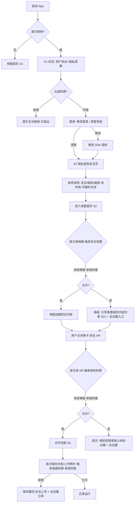
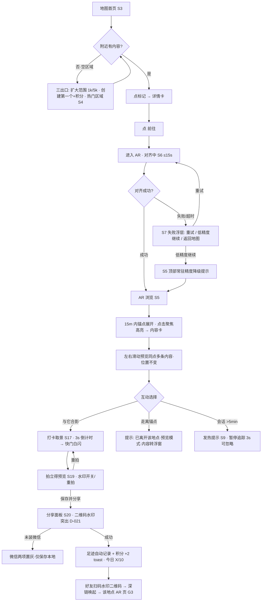
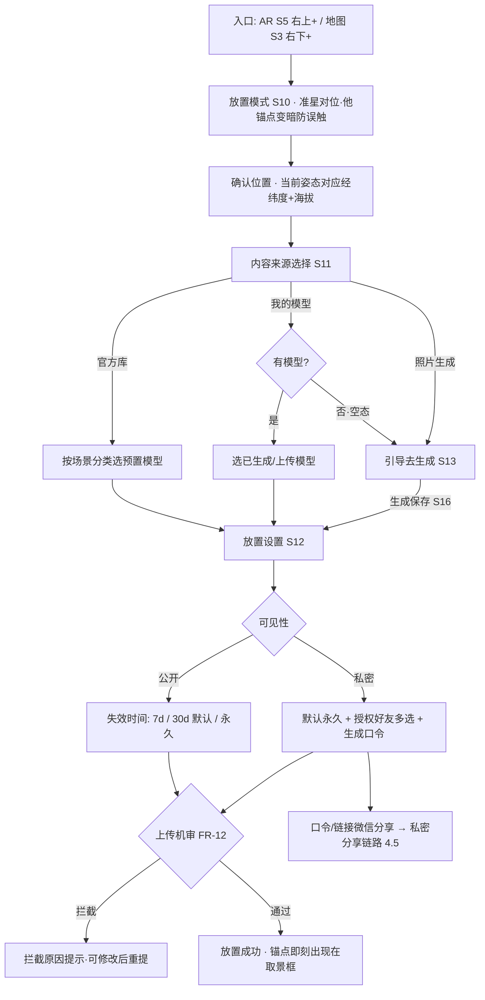
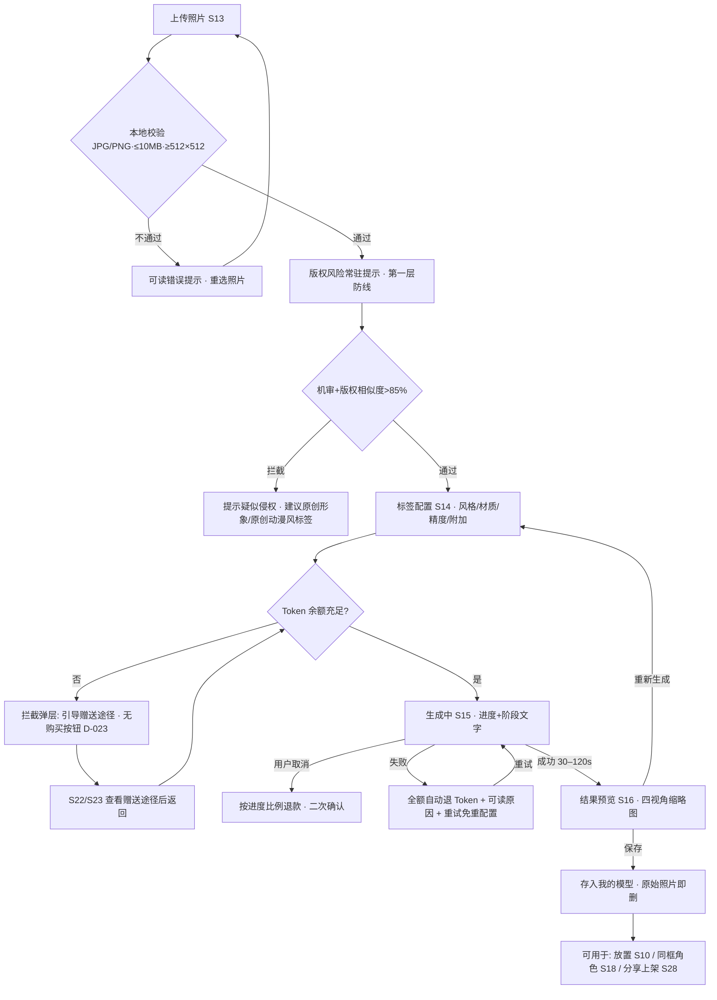
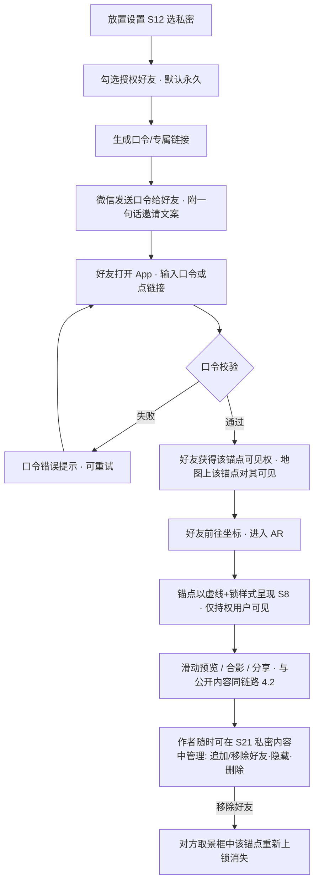

# 「VR 留念」UX 流程文档(旅程 + 信息架构 + 界面清单)

| 版本 | 日期 | 状态 | 作者 |
|---|---|---|---|
| v0.2 | 2026-08-22 | 已确认(2026-08-22 门禁 D-038~040) | 用户体验设计师 |

> 依据:requirement-doc.md v0.2(FR-01~14 对齐基准)、feature-list.md v0.2(界面相关子任务)、project-profile.md、PRD v0.2 交互原型(地图双视图/AR 滑动预览/生成配置面板/打卡合影流)。结构按 skill `ux-flow-designer` v1.1,模板 `ui-ux-spec.md` 第 1–5 节。

## 📌 文档头契约(下游先读这节)

- **关键结论**(≤5 条):
  1. 导航模式:**底部 4 Tab(地图 / AR 相机 / 商店 / 我的)**,地图为默认首页,AR 相机 Tab 视觉强调;页面层级 ≤3 层(Tab → 页 → 浮层/面板);
  2. 界面清单共 **32 屏(P0×24 / P1×7 / P2×1)**,其中 **4 屏为 AR 相机内浮层界面态**(对齐中/对齐失败降级/私密锁/发热提示,依委派要求单列);管理后台另列 6 屏简表(A1–A6);
  3. **FR-01~14 双向全覆盖**:12 条 FR 有直接界面,FR-12/FR-14 主体为系统能力+后台,界面触点经 §5.2 需求映射表交代,无静默遗漏;
  4. 权限合规触点:定位/相机/相册(均敏感个人信息)按「**首次启动隐私总览页(S2)+ 上下文触发系统弹窗 + 单独同意**」设计,落实 PRD 第 7 章"个人信息保护=阶段 5 UX 落地"行;
  5. 关键决策已内嵌界面:D-023(套餐页「即将开放」态、无任何购买按钮、余额不足只引导赠送途径)、D-022(对齐失败/精度不足降级浮层 S7)、D-021(分享面板 S20 突出二维码水印回流)、D-029(Token 消耗只显示 Token 数,不折算人民币)。
- **关键假设与置信度**:A-601~A-608 见 §7;全部为本次新增,待项目经理登记入假设账本后方可被下游引用。
- **可引用承诺**:界面清单 S1–S32(文件名 kebab-case,与 app-ui-design 原型文件一一对应)、全局组件 G1–G4、字号体系(§5.4,px)、5 张 mermaid 关键流程(§4)、边界与空态清单 E1–E26(§5.3)。
- **未决问题**:6 题(§6),随回传提交项目经理,本稿不落盘 questions 文件。

---

## 1. 用户画像(Persona)

| 编号 | 身份 | 场景 | 核心诉求 | 技术熟练度 | 频率 |
|---|---|---|---|---|---|
| P1 探索者 | 18–30 岁城市青年,打卡拍照、社交分享 | 周末逛街/出游,打开地图看附近有什么 AR 内容,前往浏览并合影发微信 | 附近有得逛、到达能看、拍得好发得出 | 中高(熟练使用地图/相机/微信) | 每周 2–3 次 |
| P2 创作者 | 有审美的 UGC 用户 | 用自己的照片生成 3D 形象,放置在有意义的位置,分享到商店换积分 | 生成门槛低、效果可控、作品有回报 | 中(愿意探索配置项,不懂建模) | 每周 1–2 次 |
| P3 留念者 | 事件驱动的普通用户 | 生日/纪念日/旅行,在特定坐标放一条私密内容,邀好友到场或虚拟同框 | 仪式感、私密可控、弥补无法到场的遗憾 | 低(低频使用,路径要短、文案要直白) | 每月 1–2 次 |

## 2. 用户旅程图

### 2.1 P1 探索者:发现 → 前往 → 合影 → 分享(P0 主链路)

情绪曲线:开屏期待↗ 空地图失落↘ 看到标记兴奋↗ 前往走路平淡→ 对齐等待焦虑↘ 锚点浮现惊喜↗ 滑动翻看沉浸↗ 合影出片满足↗ 分享回流得意↗

| 阶段 | 触点 | 动作 | 情绪 | 痛点 | 机会点 |
|---|---|---|---|---|---|
| 发现 | 地图首页 S3 | 打开 App 看附近标记/详情卡 | 期待↗ | 附近没内容,白跑一趟 | 空区域三出口(扩大范围/创建第一个+积分/热门区域)把"没内容"变"有去处"(FR-01/14) |
| 决策 | 详情卡浮层 | 看缩略图/距离/条数,点「前往」 | 兴奋↗ | 距离感不直观 | 距离+步行时间提示;15m 到达提示(FR-02) |
| 进入 AR | 对齐浮层 S6 | 举手机环视等待对齐 | 焦虑↘ | 等待 >10s 会怀疑坏了 | 「正在对齐周围空间」+进度+引导动作文案(≤15s 口径) |
| 浏览 | AR 浏览 S5 | 点击锚点聚焦、左右滑动翻看同点多条内容 | 惊喜↗↗ | 找不到其他锚点 | 边缘箭头指最近视野外锚点+小雷达;LOD「走近展开」体感 |
| 合影 | 打卡取景 S17 | 点「与它合影」→3s 倒计时→快门 | 满足↗ | 模型被误拖导致构图乱 | 模型锚定不可拖拽,靠走动构图,与景区打卡牌心智一致 |
| 分享 | 预览 S19/分享 S20 | 开关水印→保存→发微信好友/朋友圈 | 得意↗ | 分享出去别人看不懂在哪 | 拍立得水印(经纬度/日期/二维码),扫码直达该地点 AR 页——回流获客主链路(D-021) |
| 回顾 | 足迹 S31 | 时间线/地图回顾打卡 | 回味→ | — | 足迹沉淀提升复访;积分 toast(+2,今日 X/10)即时正反馈 |

### 2.2 P2 创作者:照片 → 生成 3D → 放置 → 商店(P0 生成 + P1 商店)

情绪曲线:起念兴奋↗ 上传疑虑→ 机审拦截挫败↘ 配置掌控↗ 生成等待焦虑↘ 出模惊喜↗ 放置仪式感↗ 上架被下载成就↗↗

| 阶段 | 触点 | 动作 | 情绪 | 痛点 | 机会点 |
|---|---|---|---|---|---|
| 上传 | 上传页 S13 | 选照片,看版权提示 | 疑虑→ | 怕侵权/怕照片泄露 | 第一层防线常驻提示+「照片生成后即删」隐私说明(FR-04/12) |
| 配置 | 配置面板 S14 | 选风格/材质/精度标签 | 掌控↗ | 不会建模、看不懂参数 | 中文标签驱动,无角色名输入框(版权第二层);Token 消耗实时预览(仅 Token 数,D-029) |
| 生成 | 进度 S15 | 等 30–120s,可取消 | 焦虑↘ | 黑盒等待、怕白扣 Token | 百分比+阶段文字;失败全额自动退+可读原因+免重配置重试 |
| 出模 | 结果 S16 | 四视角缩略图快览→保存 | 惊喜↗ | 全量下载慢 | 四视角先看再下 GLB;质量不合格自动免费重试一次 |
| 放置 | 放置 S10–S12 | 准星对位→可见性/失效设置 | 仪式感↗ | 坐标概念抽象 | 「即刻出现在取景框」即时反馈;私密默认永久不占公共空间 |
| 流通 | 商店 S26–S28 | 声明分享权→上架→被下载 | 成就↗↗ | 收益不透明 | 下载量/积分流水可见(5 积分/次,周去重);举报下架不追回已得积分的规则前置告知 |

### 2.3 P3 留念者:事件 → 私密放置 → 口令邀约 → 同框合影(P0 私密 + P1 同框)

情绪曲线:起念郑重→ 选私密安心↗ 配置迷茫↘(低频用户) 邀约期待↗ 好友解锁惊喜↗ 同框合影感动↗↗ 回看温暖↗

| 阶段 | 触点 | 动作 | 情绪 | 痛点 | 机会点 |
|---|---|---|---|---|---|
| 起念 | 地图 S3/放置 S10 | 特定日期到特定地点放置 | 郑重→ | 低频用户忘了怎么操作 | 放置链路三步内完成;失效时间预设档(7d/30d/永久)不逼用户算日期 |
| 私密 | 放置设置 S12 | 选私密+勾选好友名单 | 安心↗ | 怕被陌生人看到 | 私密默认永久;虚线+锁样式仅在持权好友取景框出现 |
| 邀约 | S12 口令/分享 S20 | 微信发口令/链接给好友 | 期待↗ | 解释成本高 | 口令一键复制+一句话邀请文案模板 |
| 解锁 | 私密锁浮层 S8 | 好友到场输口令→内容浮现 | 惊喜↗ | 输错口令挫败 | 口令错误明确提示可重试;通过后惊喜动效 |
| 同框 | 取景 S17/角色面板 S18 | 添加无法到场者的 3D 形象同框(≤2,可拖动) | 感动↗↗ | 形象从哪来 | 「我的虚拟好友」复用照片生成链路;官方形象库兜底;被添加方零通知零回流保护隐私 |
| 回看 | 足迹 S31/内容管理 S21 | 周年回访、隐藏或恢复内容 | 温暖↗ | 怕内容莫名消失 | 生命周期三态透明:到期自动隐藏但可一键恢复原位(FR-06) |

## 3. 信息架构(页面树 ≤3 层)

```text
VR 留念 App(底部 4 Tab)
├── Tab1 地图(默认首页)
│   ├── 地图发现首页 S3(详情卡浮层 / 空区域引导 / 聚合标记)
│   ├── 热门区域列表 S4
│   └── (定位权限拒绝退化)跳转 我的内容列表 = S21
├── Tab2 AR 相机(全屏沉浸,隐藏 TabBar)
│   ├── AR 浏览 S5(内容卡/滑动预览/边缘箭头/雷达)
│   │   ├── 浮层界面态:对齐中 S6 / 对齐失败降级 S7 / 私密锁 S8 / 发热提示 S9
│   │   └── 留言板浮层 S32(P2)
│   ├── 放置流:放置模式 S10 → 内容选择 S11 → 放置设置 S12
│   ├── 生成流:上传 S13 → 标签配置 S14 → 生成中 S15 → 结果 S16
│   └── 打卡流:取景 S17 →(同框角色面板 S18,P1)→ 预览 S19 → 分享面板 S20
├── Tab3 商店(P1;灰度可隐藏,见 A-608)
│   ├── 商店首页 S26(官方精选/社区投稿/我的创作)
│   ├── 模型详情 S27(下载抵扣/举报)
│   └── 分享上架 S28
└── Tab4 我的
    ├── 个人主页 S30(P1;游客态显示升级引导)
    ├── 打卡足迹 S31(时间线/地图双视图,打卡墙公开开关)
    ├── 我的内容管理 S21(可见/已隐藏/已删除 三 Tab)
    ├── Token·积分钱包 S22 → 套餐页 S23(即将开放)→ 流水明细 S24
    └── 设置与隐私中心 S25
启动与全局:S1 欢迎登录 → S2 隐私授权引导;深链(二维码/口令)未登录先登录后直落目标 AR 页(G3)
```

**导航模式结论**:底部 4 Tab(地图/AR 相机/商店/我的),AR 相机为中心视觉强调按钮(凸起样式);地图 Tab 为默认首页,贯彻「地图层先于相机层」;AR 全屏会话隐藏 TabBar,顶部返回/关闭回地图;所有二级页 ≤1 次返回回 Tab;第三层一律用浮层/面板(半屏 Sheet)承载,不新增页面层级。

## 4. 关键任务流程(mermaid,正常 + 异常路径)

### 4.1 首次启动与权限申请(相机 + 定位 + 相册,敏感个人信息单独同意)



> 设计要点:三项敏感权限均**上下文触发(用到才弹)+ 单独同意**,S2 只做总览说明不做一次性打包索取;每次拒绝都保留「去系统设置」恢复路径(E9/E10)。

### 4.2 探索打卡链路(发现 → 前往 → AR 浏览 → 合影 → 分享 → 足迹)



### 4.3 创作放置链路(放置 → 三来源 → 可见性/失效 → 机审 → 落库)



### 4.4 生成 3D 链路(上传 → 机审 → 标签 → 异步生成 → 保存,含退款与余额异常)



### 4.5 私密分享链路(私密放置 → 口令邀约 → 好友解锁 → 合影)



## 5. 界面清单(核心交付,与 FR 双向可溯)

### 5.1 客户端界面清单(32 屏)

> 文件名 kebab-case,与 `./UI/` 原型文件一一对应;「浮层界面态」为 AR 相机内独立呈现的浮层屏(依委派单列);优先级继承 FR 与 feature-list 子任务。

| 屏号 | 文件名 | 界面名称 | 目的 | 关键元素(主态) | 组件规格态 | 导航/图标建议 | 需求 ID | 优先级 |
|---|---|---|---|---|---|---|---|---|
| S1 | app-splash | 启动与登录页 | 承接协议同意与账号建立 | Logo+一句话价值;协议/隐私政策勾选;微信登录主按钮;游客体验次入口 | 协议未勾选登录置灰;微信授权失败重试;游客态升级引导角标 | 无 Tab;微信图标 | FR-07、FR-12(协议) | P0 |
| S2 | privacy-consent | 隐私授权总览页 | 敏感个人信息(定位/相机/相册)单独同意前的集中说明 | 三张权限卡(何时用/为何用/可随时关闭);逐项「了解并同意」;「进入地图」按钮 | 单项拒绝时的降级后果说明(定位→内容列表;相机→无 AR;相册→不能保存/上传) | 盾牌图标;权限图标×3 | FR-01/02/04、合规第 7 章 | P0 |
| S3 | map-home | 地图发现首页(Tab1·默认) | 附近内容发现与前往决策 | 全屏地图;用户定位点;内容标记(类型图标/距离/条数徽标);聚合数字标记;半径切换 500m/1k/5k;顶部「附近 N 处」;详情卡浮层(缩略图/标题/作者/距离/条数/前往);右下「+」放置;热门区域入口 | **空区域三出口**(扩大范围/创建第一个+积分激励文案/热门区域);定位权限拒绝退化态(入口跳 S21);加载骨架;无网络重试;低缩放聚合态 | Tab 图标:地图;标记类型图标:模型/图片/文字三色 | FR-01、FR-14、FR-08(点赞载体) | P0 |
| S4 | hot-areas | 热门区域列表 | 导流到内容密集区(冷启动) | 区域卡(城市/地标/内容数/距离/代表缩略图);点击跳地图定位 | 空态(暂无热门区域);加载失败 | 火焰/排行图标 | FR-01、FR-14 | P0 |
| S5 | ar-view | AR 浏览取景框(Tab2) | 空间锚定浏览与滑动预览 | 全屏取景;3D 锚点(LOD 分层);点击聚焦高亮(脉冲光环);底部内容卡(类型图标/标题/作者/可见性/点赞数);左右箭头+分页点 1/N;右上「+」放置;边缘箭头(仅最近视野外锚点);72px 小雷达;顶部经纬度+附近 N 处;15m 到达提示;模式徽标(浏览/取景/拍摄/预览) | 单内容箭头置灰;离开锚点预览模式提示条(内容转浮窗);低端设备降级半透明浮窗渲染;锚点加载中;无内容引导退出;私密锚点虚线+锁(持权) | Tab 图标:相机(凸起主按钮);切换箭头 | FR-02、FR-08(点赞) | P0 |
| S6 | ar-align-overlay | 对齐等待浮层(界面态) | 首次空间对齐进度反馈(D-022 GPS+罗盘) | 「正在对齐周围空间」扫描动画;进度条(≤15s);动作引导文案(持机缓慢环视) | >15s 自动转 S7;重试循环不叠加弹层 | 环视手势示意图 | FR-02、D-022 | P0 |
| S7 | ar-align-fail-overlay | 对齐失败/精度不足降级浮层(界面态) | 对齐失败出口与降级继续 | 失败原因(磁场干扰/GPS 信号弱);「重试」;「以低精度模式继续」;「返回地图」 | 低精度继续后 S5 顶部常驻小字「精度降级·模型位置可能偏移」 | 警示图标 | FR-02、D-022 | P0 |
| S8 | ar-private-lock | 私密内容解锁浮层(界面态) | 私密内容可见性校验与特殊呈现 | 口令输入框/链接校验;校验通过动效;解锁后锚点虚线+锁样式(仅持权可见) | 口令错误重试;权限被移除后再次上锁;无权限用户完全不可见(非本屏呈现) | 锁图标;虚线描边样式 | FR-03 | P0 |
| S9 | ar-thermal-overlay | 发热提示浮层(界面态) | 连续 AR 会话 >5min 发热治理 | 「建议休息」文案;3s 暂停追踪倒计时;「继续使用」可忽略 | 每会话仅弹一次;倒计时结束自动恢复 | 温度/月牙图标 | FR-02(边界) | P0 |
| S10 | place-mode | 放置对位模式 | 空间对位与放置入口 | 中心十字准星;其余锚点变暗不可点(防误触);底部引导条「对准位置 → 确认」;确认按钮 | 海拔异常提示;对位超时引导移动重试 | 准星图标 | FR-03 | P0 |
| S11 | content-picker | 内容来源选择 | 三路径选内容 | 三入口卡:官方库(节日/情绪/地标/装饰分类)/我的模型(生成+上传)/照片生成(跳 S13);模型 3D 缩略预览;搜索 | 我的模型空态(引导生成);官方库加载失败;私密授权好友选择器入口(私密时) | 文件夹/立方体/相机图标 | FR-03 | P0 |
| S12 | place-settings | 放置设置 | 可见性/失效/授权配置 | 可见性单选(公开/私密);失效时间三档(7d/30d 默认/永久;私密默认永久);私密授权好友多选;口令生成+一键复制;放置确认按钮 | 私密未选好友警告;机审拦截原因提示;放置中 Loading | 锁/地球图标;日历图标 | FR-03、FR-12 | P0 |
| S13 | gen-upload | 上传照片 | 照片采集与预校验 | 拍照/从相册选;格式大小说明(JPG/PNG ≤10MB ≥512×512);版权风险常驻提示(第一层防线);「照片生成后即删」隐私说明;上传进度 | 格式/大小/分辨率不通过的可读错误;相册权限拒绝引导;机审拦截(违规/疑似侵权>85% 建议原创) | 相机/相册图标;警示条 | FR-04、FR-12 | P0 |
| S14 | gen-config | 标签配置面板 | 标签驱动参数配置(防注入·无角色名输入框) | 整体风格(卡通/Q 版/写实/低多边形/原创动漫风);材质(哑光/光泽/金属/陶瓷);贴图精度(2K/4K/8K);附加(PBR/优化拓扑);API 参数预览(折叠);**Token 消耗实时预览(仅 Token 数,D-029)**;余额胶囊常驻(G1);「开始生成」 | 余额不足拦截弹层(引导赠送途径·无购买按钮,D-023);标签组合变化时消耗即时刷新 | 标签胶囊样式;Token 图标 | FR-04、FR-07、FR-12 | P0 |
| S15 | gen-progress | 生成进度 | 异步生成等待与取消 | 百分比+阶段文字(排队/建模/贴图);进度条;「取消生成」(触发比例退款确认) | 失败态:全额自动退 Token+可读原因(照片特征不足/服务繁忙)+「重试」免重配置;弱网转轮询兜底提示 | 沙漏/旋转图标 | FR-04 | P0 |
| S16 | gen-result | 结果预览 | 四视角快览与保存决策 | front/right/back/left 四视角缩略图;「保存到我的模型」;「重新生成」(再扣 Token 提示);「去放置」;(P1)「分享到商店」 | 质量不合格自动免费重试提示;保存失败重试;AI 生成内容标识角标(深度合成合规) | 四宫格布局 | FR-04、FR-12(标识) | P0 |
| S17 | checkin-viewfinder | 打卡取景模式 | 合影构图与拍摄 | 「模型固定·走动构图」提示;拍摄大按钮;3s 倒计时数字;快门白闪动画;「添加同框角色」入口(P1);同框角色拖动/朝向/缩放手势(≤2 个);模式徽标切换 | 低端设备「仅支持 1 个同框角色」提示;退出取景二次确认(防误触丢失构图) | 快门圆钮;人物+图标 | FR-05、FR-11(入口与摆放) | P0 |
| S18 | companion-picker | 同框角色面板(P1) | 同框角色选择 | 双 Tab:官方虚拟形象库/我的虚拟好友;角色卡(缩略图);已选列表(≤2);伦理常驻提示(仅本人或已获同意亲友) | 虚拟好友空态(引导照片生成);低端限 1 个;滥用举报入口 | 人物图标 | FR-11 | P1 |
| S19 | photo-preview | 拍立得预览 | 成片确认与水印控制 | 拍立得样式成片;位置水印(经纬度/日期/**二维码**,D-021)+开关(记忆偏好);「重拍」;「保存并分享」 | 水印偏好记忆(关过则默认关);保存到相册失败重试;保存成功 Toast | 相框样式;水印开关 | FR-05 | P0 |
| S20 | share-sheet | 分享面板 | P0 获客回流主链路(D-021) | 微信好友/朋友圈/保存本地三选项;二维码水印说明(扫码直达该地点 AR 页);打卡积分 toast「+2 · 今日已获 X/10」 | 未装微信:两项置灰仅存本地;积分达日上限提示(不加分仍可保存);分享失败重试 | 微信图标;二维码角标 | FR-05、FR-08 | P0 |
| S21 | content-manage | 我的内容管理 | 生命周期三态管理 | 三 Tab(可见/已隐藏[含到期原因]/已删除[30 天回收]);条目(缩略图/坐标/可见性/到期时间);操作:隐藏/重新开启(恢复原坐标)/永久删除;私密内容锁标 | 回收站到期倒计时;空态(还没放置过内容);批量操作 | Tab 图标:我的→内容;回收站图标 | FR-06、FR-03(退化列表) | P0 |
| S22 | wallet-home | Token·积分钱包 | 双轨资产总览 | Token 余额大字;积分余额;流水入口;积分规则说明(10 积分≈1 Token·仅商店社区模型抵扣·不可购生成);套餐入口(「即将开放」角标);赠送途径说明(注册赠送/活动发放) | 无流水空态;自然年清零提醒;游客态先登录提示 | Tab 图标:我的→钱包 | FR-07、FR-08 | P0 |
| S23 | token-packages | Token 套餐页(即将开放) | 四档展示与赠送引导(D-023) | 四档卡(体验/标准/常用/重度·Token 数);全部「即将开放」态;赠送获取途径引导文案;**无任何购买按钮/价格支付元素** | 全禁用态;二期开放后转可购(预留布局) | 锁+「即将开放」角标 | FR-07、D-023 | P0 |
| S24 | ledger-detail | 流水明细 | Token/积分账目追溯 | 双 Tab(Token/积分);类型筛选(消耗/退还/赠送/奖励/抵扣);分页列表(时间/事项/数额) | 空态;加载失败 | 列表图标 | FR-07、FR-08 | P0 |
| S25 | settings | 设置与隐私中心 | 权限/协议/偏好管理 | 权限状态卡×3(定位/相机/相册·跳系统设置);协议与隐私政策版本(同意记录留痕);水印偏好;AI 深度合成告知;退出登录/注销 | 权限被系统关闭的红点提醒;游客态显示升级引导 | 齿轮图标 | FR-12(协议 R-5)、合规 | P0 |
| S26 | store-home | 商店首页(Tab3·P1) | 模型获取与贡献 | 三区 Tab:官方精选/社区投稿(下载量/点赞排序)/我的创作(下载数据);模型卡(四视角缩略图/标题/创作者/下载量/点赞/**价格:Token 数或积分**);筛选 | 社区空态(成为第一个投稿者);已下架灰条;加载失败 | Tab 图标:商店(货架) | FR-09 | P1 |
| S27 | model-detail | 模型详情(P1) | 下载决策 | 3D/四视角预览;AI 生成标识;创作者与下载量;支付方式选择(Token/积分 10:1 抵扣);下载确认(显示本次消耗);举报入口;点赞 | 余额不足引导(赠送途径/积分抵扣切换);已下载态(可直接使用);已下架态 | 下载图标;举报角标 | FR-09、FR-08、FR-12 | P1 |
| S28 | share-to-store | 分享上架(P1) | 投稿与版权声明 | 分享权声明勾选(原创/有权分享);从我的模型选择;提交审核;状态展示(待审/已上架/驳回+原因) | 审核中禁改;驳回可申诉重提 | 上架/审核图标 | FR-09、FR-12 | P1 |
| S29 | report-entry | 举报入口(P1) | 第四层防线用户侧入口 | 举报对象摘要;理由单选(侵权/违规内容/其他)+补充说明;提交(承诺 48h 内人工复核) | 提交成功反馈;重复举报提示 | 警示图标 | FR-12 | P1 |
| S30 | profile-home | 个人主页(Tab4·P1) | 身份与入口聚合 | 头像/昵称;足迹摘要(打卡数/城市数);打卡墙公开开关;入口列表(足迹/内容管理/钱包/商店我的创作/设置) | 游客态(升级引导);零足迹空态 | Tab 图标:我的(人像) | FR-13 | P1 |
| S31 | footprints | 打卡足迹(P1) | 双视图回顾 | 时间线/地图双视图 Tab;足迹卡(照片/内容信息/坐标/时间) | 空态(还没有打卡·去逛逛);地图视图复用 S3 组件 | 时间线/地图切换图标 | FR-13 | P1 |
| S32 | comments-sheet | 留言板(P2) | 单向单次评论(数字留言簿) | 公开留言列表;提交框(最低字数);发布后 24h 内「修改一次」;锁定态;「每人一条·作者不可回复」说明 | 已评论锁定;重复提交被拒;机审中;评论积 +2 提示 | 对话气泡图标 | FR-10、FR-08 | P2 |

**全局组件(非独立屏,原型以复用组件呈现)**:

| 编号 | 组件 | 说明 | 依据 |
|---|---|---|---|
| G1 | Token 余额常驻胶囊 | 顶栏胶囊(Token 数),出现于 S14/S15/S27 等消耗场景;点击直落 S22;**只显示 Token 数**(D-029) | K-1(FR-07) |
| G2 | 三态组件库 | 加载(骨架/进度)/成功(Toast ≤2s)/失败(可读原因+重试)统一组件 | A-6 |
| G3 | 深链路由 | 二维码水印/口令链接/商店页唤起 App → 未登录先登录 → 直落目标 AR 页/商店详情 | D-021、FR-05 |
| G4 | 积分 Toast | 打卡/评论/被下载等积分入账即时反馈(含今日进度 X/10) | FR-08 |

### 5.2 需求映射(无独立界面的 FR/子任务,双向可溯)

| 需求 ID | 去向(某屏组件 / 系统能力 / 无 UI) | 说明 |
|---|---|---|
| FR-01~FR-06、FR-07、FR-09~FR-11、FR-13 | 直接界面:S3~S24、S26~S31、S32 | 见 5.1「需求 ID」列,双向可查 |
| FR-12(审核版权四层防线) | 界面触点分散:S13 版权提示(一层)/S14 无角色名输入框(二层)/S13 机审拦截+S16 AI 标识(三层)/S28 分享权声明+S29 举报(四层);主体=系统能力+后台 A3 | 四层防线大部分为无 UI 管道 |
| FR-14(seeding 运营) | 界面触点:S3 空区域「创建第一个」激励文案;主体=后台 A5/A6;官方内容制作归运营美术(A-502) | 客户端仅露出激励文案 |
| FR-08(积分六类获取) | 动作触点分散:S20 打卡/S28 上架/S32 评论/S5·S27 点赞组件;账务在 S22/S24+G4 | 规则与防刷为服务端(P-3/P-4) |
| FR-02 设备分级渲染 | S5/S17 组件规格态(低端浮窗/限 1 同框角色) | A-4 三档渲染管线,无独立 UI |
| FR-05 足迹记录 | 自动落库,界面在 S31;打卡墙公开开关在 S30/S31 | 无操作界面 |
| R-5 协议同意记录 | S1/S2/S25 | 服务端留痕 |
| 点赞交互(I-5,feature-list §6 Q2 待确认) | S5 内容卡+S27 模型卡组件(最小实现) | 本稿按最小实现,待 PM 确认(见 §6 Q2) |

### 5.3 边界与空态清单(E1–E26)

| 编号 | 场景 | 出现界面 | 处理与文案要点 | 需求依据 |
|---|---|---|---|---|
| E1 | 地图空区域(附近无内容) | S3 | 「附近暂无内容」+三出口:扩大范围(1k/5k)/创建第一个(+积分激励)/热门区域 | FR-01/FR-14 |
| E2 | 定位权限拒绝 | S3 | 退化为「查看我创建的所有内容列表」入口(跳 S21)+「去设置」恢复引导 | FR-01 |
| E3 | 无网络/弱网 | S3/S5/S15/S26 | 地图离线灰图+重试;AR 锚点元数据同步失败提示;生成转轮询兜底;商店缓存展示 | 非功能 |
| E4 | AR 对齐失败/超时(>15s) | S7 | 失败原因+重试+「低精度模式继续」+返回地图 | FR-02/D-022 |
| E5 | AR 精度不足但可用 | S5 | 顶部常驻「精度降级·模型位置可能偏移」小字;锚点加虚线辅助标 | FR-02/D-022 |
| E6 | 走离原锚点 | S5 | 「你已离开该地点,当前为预览模式」提示条;内容转固定浮窗渲染,不强制关卡 | FR-02 |
| E7 | AR 连续使用 >5min 发热 | S9 | 「建议休息」暂停追踪 3s 自动恢复,可忽略;每会话仅一次 | FR-02 |
| E8 | 私密内容无权限 | S5 | 完全不可见(不提示存在);持权者见虚线+锁样式 | FR-03 |
| E9 | 相机权限拒绝 | S5 入口 | 「相机权限是核心体验必需」+去设置;无法进入 AR | FR-02 |
| E10 | 相册权限拒绝 | S13/S19 | 上传不可用/保存置灰+去设置引导 | FR-04/05 |
| E11 | 上传校验失败(格式/大小/分辨率) | S13 | 逐项可读错误(如「图片小于 512×512,请换一张」)+重选 | FR-04 |
| E12 | 机审拦截(违规/相似度>85%) | S13/S12/S28 | 「疑似侵权,建议使用原创形象」;可改后重提;不透露阈值细节 | FR-12 |
| E13 | 生成失败 | S15 | Token 全额自动退还+可读原因(照片特征不足/服务繁忙)+重试免重配置 | FR-04 |
| E14 | 取消生成 | S15 | 二次确认「已生成 X%,将退还 Y Token」按比例退款 | FR-04 |
| E15 | Token 余额不足 | S14/S27 | 拦截弹层:引导赠送途径(注册/活动);**不出现购买按钮**;商店场景可切积分抵扣 | FR-07/D-023 |
| E16 | 微信未安装 | S20 | 微信好友/朋友圈置灰,仅「保存本地」可用 | FR-05 |
| E17 | 保存到相册失败 | S19/S20 | 失败原因+重试;照片临时保留会话内 | FR-05 |
| E18 | 打卡积分达日上限(10) | S20 | 「今日积分已达上限,打卡仍可保存照片」 | FR-05/FR-08 |
| E19 | 评论重复提交/超 24h | S32 | 「每个内容只能留言一次」;超时按钮转锁定态 | FR-10 |
| E20 | 私密授权名单为空 | S12 | 警告「未选择好友将无法被看到」+去选择 | FR-03 |
| E21 | 商店社区投稿为空 | S26 | 「成为第一个投稿者」+去上架引导 | FR-09 |
| E22 | 低端设备渲染降级 | S5/S17/S18 | 内容转半透明浮窗;同框「设备性能不足,仅支持 1 个同框角色」 | FR-02/FR-11 |
| E23 | 内容到期自动隐藏 | S21 | 已隐藏 Tab 显示到期原因;30 天回收期倒计时;可重开恢复原位 | FR-06 |
| E24 | 商店模型被下架 | S26/S27 | 灰条「已下架」;已下载者本地保留;积分不追回 | FR-09/FR-12 |
| E25 | 口令错误 | S8 | 「口令不正确,请核对后重试」;5 次失败冷却提示 | FR-03 |
| E26 | 游客态触发需登录操作 | S10/S13/S20 等 | 弹层「登录后即可放置/生成/分享」+微信一键登录;游客合并机制(A-602) | FR-07/A-3 |

### 5.4 交互原则

- **三态反馈**:一切网络/生成操作必有 加载(骨架屏/进度百分比)/成功(Toast ≤2s)/失败(可读人话原因+重试入口)三态;AR 场景用模式徽标(浏览/取景/拍摄/预览)常显当前状态。
- **手势**:AR 内容卡左右滑动切换(点击箭头等效,模型世界位置不变);同框角色单指拖动站位、双指旋转/缩放;地图双指缩放;放置模式他锚点变暗防误触;打卡取景退出二次确认。
- **单手可达**:核心操作按钮(快门/前往/分享)置于屏幕下 1/3;AR 沉浸会话隐藏 TabBar。
- **字号体系(一律 px,下游 HTML 等值直接使用)**:大标题 24 / 页面标题 20 / 正文 16 / 次要说明 14 / 辅助与徽标 12(最小值,AR HUD 不小于 12);对比度正文 ≥4.5:1;触控目标 ≥44×44 px。
- **性能感知**:对齐 ≤15s 用进度动画+动作引导;生成 30–120s 用百分比+阶段文字;上传/下载显示速率与可取消。
- **合规内嵌**:版权提示/隐私说明/AI 标识在动作发生处就近呈现(S13/S16/S27),不集中在长协议里;权限说明先于系统弹窗。

## 6. 待决策问题(回传项目经理,本稿不落盘)

见 §8 回传(编号 Q1–Q6)。

## 7. 本次工作假设清单(待登记 memory/decisions.md 假设账本)

- A-601:导航为底部 4 Tab(地图/AR 相机/商店/我的),AR 相机中心凸起按钮;商店 Tab 灰度可隐藏(高,业界常规 AR/地图 App 模式)。
- A-602:游客可浏览地图与 AR;放置/生成/打卡/商店下载需微信登录(游客合并由 L-5 支撑)(中,A-3 未定边界,已列 Q1)。
- A-603:敏感权限采用「首次启动隐私总览页 + 上下文触发系统弹窗 + 单独同意」,非一次性打包索取(高,合规最佳实践,可被 PM 推翻改一次性授权)。
- A-604:生成失败/取消均在 S15 以规格态呈现,不设独立失败屏(高,减少屏数)。
- A-605:留言板(FR-10)以半屏浮层复用于 AR 内容卡与商店详情(中,P2 细节可后调)。
- A-606:Token 余额以全局胶囊 G1 常驻于消耗场景顶栏,而非所有页面(高,依 K-1「常驻显示」口径)。
- A-607:深链(二维码/口令)未登录时先登录再直落目标页(高,常规路由)。
- A-608:商店为一级 Tab 但支持灰度隐藏开关,冷启动期内容不足时先隐藏(中,运营策略)。

## 8. 管理后台界面简表(AntD Pro,另列;不做高保真,仅交代去向)

| 编号 | 文件名 | 界面名称 | 对应子任务 | 关键元素 | 优先级 |
|---|---|---|---|---|---|
| A1 | admin-login | 后台登录与 RBAC | U-1 | 账号登录/角色权限(内部 ≤10 人) | P0 |
| A2 | admin-content | 内容管理 | U-2 | 锚点列表/地图预览/详情/强制下架 | P0 |
| A3 | admin-review | 审核工作流 | U-3 | 机审复核队列/模型抽检/举报工单(48h SLA) | P0 |
| A4 | admin-account | 用户与账本 | U-4 | 用户查询/Token 流水/人工退款/积分调整 | P0 |
| A5 | admin-seeding | seeding 运营工具 | U-5 | 官方库管理/批量放置(≥50 锚点)/城市配置 | P1 |
| A6 | admin-dashboard | 运营数据看板 | U-6 | DAU/打卡/生成成功率等基础指标 | P1 |
